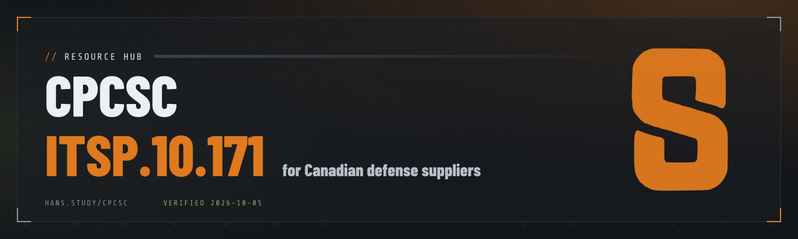

The Canadian Program for Cyber Security Certification (CPCSC) is becoming a condition of contract award for Canadian defense suppliers, and most of what's written about it sits behind a form or a sales call. This repo puts it in one place: all 98 ITSP.10.171 controls explained in plain language, Windows audit scripts that write evidence you can file, templates, and a curated set of resources that link out to the primary sources. It's built for the network admin at a 30-person shop who just got handed compliance.

It's the working companion to [The Study Guide to CPCSC Readiness](https://hans.study/cpcsc_book/), a free book, and it's open: [add a resource](#add-a-resource) if you've found something that belongs here.

> Not affiliated with Public Services and Procurement Canada (PSPC), the Canadian Centre for Cyber Security, NIST, or the CMMC program. Nothing here is an attestation, a certification, or legal advice. CPCSC is still being developed, so check the [updates log](https://hans.study/cpcsc/updates/) and the contract in front of you.

## Start here

| Folder | What's in it |
|---|---|
| [`controls/`](controls/) | All 98 requirements by family: a plain-language reading, the evidence to keep, the values you set, and links to the standard. Plus the [Level 1 checklist](controls/level-1-checklist.md) and [crosswalk](controls/level-1-crosswalk.md). |
| [`scripts/`](scripts/) | Read-only PowerShell that audits a Windows machine for the technical requirements and writes HTML, JSON, and CSV reports, plus a script that merges many machines into a fleet summary |
| [`resources/`](resources/) | Government sources, standards, CMMC, hans.study material, tools and baselines, and a glossary |
| [`templates/`](templates/) | A [gap register](templates/gap-register.csv) with a row per requirement |
| [`data/`](data/) | The requirements and the Level 1 crosswalk as JSON and CSV |

## Where the program stands

Last verified October 5, 2026, against PSPC's program overview (revised September 29, 2026), its Level 1 guidance, and the Cyber Centre's ITSP.10.171.

| Level | Status | What it is |
|---|---|---|
| 1 | Live | Annual self-assessment against 13 requirements through PSPC's online tool, with the result and expiry date confirmed in your CanadaBuys profile. Open since April 1, 2026 and in select defense contracts since summer 2026. |
| 2 | Planned for spring 2027 | Third-party assessment of all 98 requirements by Standards Council of Canada accredited certification bodies, every 3 years with an annual affirmation. A completed Level 1 self-assessment is a prerequisite. |
| 3 | In development | Assessed by National Defence against 130-plus controls: the 98 plus enhancements adapted from NIST SP 800-172. Restated from 200 on September 29, 2026. |

Recognition between programs is limited. PSPC may accept a valid CMMC certification case by case at Level 1, after confirming its scope covers the Canadian contract data. Nothing is announced for Levels 2 and 3.

Not yet published: the Level 2 assessment methodology, the list of accredited certification bodies, fee structures, rules for open items at assessment, Level 3 criteria, and any CMMC recognition beyond Level 1. PSPC revises its pages without press releases, so the dated [updates log](https://hans.study/cpcsc/updates/) tracks changes as they happen.

## What CPCSC is

CPCSC is run by PSPC. It sets cyber security requirements for suppliers on Government of Canada defense contracts and verifies them through 3 certification levels. The level a supplier needs is named in the solicitation and the contract, one contract at a time. Enforcement runs through procurement: a supplier who can't show the named level isn't eligible for that award, and Level 1 is required at contract award, with proof included in the bid.

The program protects Specified Information, sensitive but unclassified government information that a contract identifies as needing safeguarding on supplier systems. Drawings, statements of work, schedules, pricing, and Controlled Goods data are typical. It reaches any supplier whose systems store, process, or transmit it under a defense contract, at any tier. The test is the data, not company size, and a prime's certification doesn't cover its subcontractors.

## Level 1: the 13 requirements

Answer them against the systems inside your boundary only, after you've mapped where Specified Information lives. Each one links to its entry in [`controls/`](controls/).

| ITSP.10.171 | Requirement |
|---|---|
| [`03.01.01`](controls/01-access-control.md#030101-account-management-level-1) | Account management |
| [`03.01.02`](controls/01-access-control.md#030102-access-enforcement-level-1) | Access enforcement |
| [`03.01.20`](controls/01-access-control.md#030120-use-of-external-systems-level-1) | Use of external systems |
| [`03.01.22`](controls/01-access-control.md#030122-publicly-accessible-content-level-1) | Publicly accessible content |
| [`03.05.01`](controls/05-identification-and-authentication.md#030501-user-identification-authentication-and-re-authentication-level-1) | User identification, authentication, and re-authentication |
| [`03.05.02`](controls/05-identification-and-authentication.md#030502-device-identification-and-authentication-level-1) | Device identification and authentication |
| [`03.05.03`](controls/05-identification-and-authentication.md#030503-multi-factor-authentication-level-1) | Multi-factor authentication |
| [`03.08.03`](controls/08-media-protection.md#030803-media-sanitization-level-1) | Media sanitization |
| [`03.10.01`](controls/10-physical-protection.md#031001-physical-access-authorizations-level-1) | Physical access authorizations |
| [`03.10.07`](controls/10-physical-protection.md#031007-physical-access-control-level-1) | Physical access control |
| [`03.13.01`](controls/13-system-and-communications-protection.md#031301-boundary-protection-level-1) | Boundary protection |
| [`03.14.01`](controls/14-system-and-information-integrity.md#031401-flaw-remediation-level-1) | Flaw remediation |
| [`03.14.02`](controls/14-system-and-information-integrity.md#031402-malicious-code-protection-level-1) | Malicious code protection |

The technical bar is modest, and the weight sits in the signature: the attestation is a representation made in a federal contract context, renewed every year. The one that catches people is `03.05.03`. It requires multi-factor authentication for privileged and non-privileged accounts, and CMMC Level 1 has no such requirement, so a shop that cleared CMMC Level 1 on passwords isn't at CPCSC Level 1 yet. The [Level 1 checklist](controls/level-1-checklist.md) adds the evidence to keep and the filing steps.

## The standard: ITSP.10.171

ITSP.10.171 is the Cyber Centre's Canadian version of NIST SP 800-171 Revision 3: 98 requirements in 17 families, each with discussion text. Identifiers match NIST's, the ones NIST withdrew stay in the numbering as "not allocated," and Canada added one requirement of its own, `03.14.09`, the dedicated administration workstation. The second release, the current one, is dated October 28, 2025.

| Code | Family | Requirements | At Level 1 |
|---|---|---|---|
| 01 | [Access control](controls/01-access-control.md) | 16 | 4 |
| 02 | [Awareness and training](controls/02-awareness-and-training.md) | 2 |  |
| 03 | [Audit and accountability](controls/03-audit-and-accountability.md) | 8 |  |
| 04 | [Configuration management](controls/04-configuration-management.md) | 10 |  |
| 05 | [Identification and authentication](controls/05-identification-and-authentication.md) | 8 | 3 |
| 06 | [Incident response](controls/06-incident-response.md) | 5 |  |
| 07 | [Maintenance](controls/07-maintenance.md) | 3 |  |
| 08 | [Media protection](controls/08-media-protection.md) | 7 | 1 |
| 09 | [Personnel security](controls/09-personnel-security.md) | 2 |  |
| 10 | [Physical protection](controls/10-physical-protection.md) | 5 | 2 |
| 11 | [Risk assessment](controls/11-risk-assessment.md) | 3 |  |
| 12 | [Security assessment and monitoring](controls/12-security-assessment-and-monitoring.md) | 4 |  |
| 13 | [System and communications protection](controls/13-system-and-communications-protection.md) | 10 | 1 |
| 14 | [System and information integrity](controls/14-system-and-information-integrity.md) | 6 | 2 |
| 15 | [Planning](controls/15-planning.md) | 3 |  |
| 16 | [System and services acquisition](controls/16-system-and-services-acquisition.md) | 3 |  |
| 17 | [Supply chain risk management](controls/17-supply-chain-risk-management.md) | 3 |  |

Many requirements leave a value to you: the inactivity period before an account is disabled, failed logons before lockout, log retention, patch windows. Unless the contract names one, you choose it, record it in your system security plan, and defend it at assessment. Each control page marks where that applies.

## CPCSC and CMMC

The 2 programs share a technical spine and almost nothing else.

| | CPCSC (Canada) | CMMC (United States) |
|---|---|---|
| Owner | PSPC | Department of Defense |
| Standard | ITSP.10.171, from NIST SP 800-171 Rev 3 | NIST SP 800-171 Rev 2 |
| Level 1 | 13 requirements, MFA included | 15 requirements (FAR 52.204-21), no MFA |
| Level 2 | 98 requirements, third-party assessed | 110 requirements |
| Level 3 | 130-plus controls, assessed by National Defence | Level 2 plus 24 from NIST SP 800-172 |
| Results filed in | CanadaBuys | SPRS |

The full comparison is in [CMMC and the US program](resources/cmmc-and-us.md).

## Timeline

| Date | What happened |
|---|---|
| Fall 2023 | Treasury Board approved CPCSC; Budget 2023 set aside $25 million for design and implementation through 2025 to 2026 |
| March 2025 | Phase 1 launched; the Standards Council of Canada began accepting certification body applications |
| April 2, 2025 | ITSP.10.171 first release took effect |
| October 28, 2025 | ITSP.10.171 second release, the current version |
| April 1, 2026 | Level 1 self-assessment opened through CanadaBuys |
| April 14, 2026 | PSPC formally announced Level 1 |
| Summer 2026 | Level 1 requirements began appearing in select defense contracts |
| September 29, 2026 | PSPC revised its program overview and restated Level 3 as 130-plus controls |
| Spring 2027 | Level 2 third-party assessments planned for select contracts |

## Where to start

1. List the contracts carrying Specified Information clauses.
2. Map where that data lives and draw the boundary around those systems.
3. Answer the 13 Level 1 requirements against those systems only.
4. Capture one dated evidence artifact per requirement.
5. Fix gaps before attesting; Level 1 gaps are cheap.
6. Record the result and expiry date in CanadaBuys.
7. Re-run the assessment when the environment changes, and again before the expiry date.

If Level 2 is ahead of you, scoping comes before anything you buy, because where Specified Information lives decides what you pay. To check the technical side of a Windows machine, run the [audit script](scripts/README.md). To apply Windows hardening baselines for CMMC and CPCSC readiness, use [`CMMC-CPCSC-ITSP10171.ps1`](https://github.com/hansstudy/windows-hardening-scripts/blob/main/CMMC-CPCSC-ITSP10171.ps1) in the [windows-hardening-scripts](https://github.com/hansstudy/windows-hardening-scripts) repo.

## The book

The Study Guide to CPCSC Readiness: A Field Reference for Canadian Defense Suppliers is Book 3 in The Study Guide series by Hans Study. First edition, revision 1.3.2, October 2026. 12 chapters, free to read online or download, DOI [10.5281/zenodo.23145960](https://doi.org/10.5281/zenodo.23145960), CC BY-ND 4.0.

[Site copy](https://hans.study/cpcsc_book/) · [Zenodo v1.3.2](https://zenodo.org/records/23171055) · DOI [10.5281/zenodo.23145960](https://doi.org/10.5281/zenodo.23145960) · [Internet Archive](https://archive.org/details/the-study-guide-to-cpcsc-readiness-hans-study) · [Wikidata Q141648473](https://www.wikidata.org/wiki/Q141648473)

Also: [Download the PDF](https://hans.study/cpcsc_book/hans-study-the-study-guide-to-cpcsc-readiness.pdf) · [Sampler PDF](https://hans.study/cpcsc_book/cpcsc-readiness-sampler.pdf) · [Templates](https://hans.study/cpcsc/templates/) · [Policy builder](https://hans.study/tools/policy-builder/)

## Primary sources

| Source | Why it matters |
|---|---|
| [PSPC program overview](https://www.canada.ca/en/public-services-procurement/services/industrial-security/security-requirements-contracting/cyber-security-certification-defence-suppliers-canada/program-overview.html) | The federal bodies, the outcomes, and the level definitions |
| [How to meet Level 1 requirements](https://www.canada.ca/en/public-services-procurement/services/industrial-security/security-requirements-contracting/cyber-security-certification-defence-suppliers-canada/meet-level1-certification-requirements.html) | PSPC's Level 1 criteria and the scoping guide |
| [CPCSC Level 1 self-assessment tool](https://cyberpostureassessments.ops.cyber.gc.ca/cpcsc-pccc) | Where the annual self-assessment is completed |
| [ITSP.10.171](https://www.cyber.gc.ca/en/guidance/protecting-specified-information-non-government-canada-systems-and-organizations-itsp10171) | The Cyber Centre standard, with discussion text for every requirement |
| [NIST SP 800-171 Rev 3](https://csrc.nist.gov/pubs/sp/800/171/r3/final) | The US document ITSP.10.171 adapts |
| [Standards Council of Canada, CPCSC](https://scc-ccn.ca/accreditation-scheme/inspection-bodies/canadian-program-cyber-security-certification) | Accreditation of the Level 2 certification bodies |
| [CanadaBuys](https://canadabuys.canada.ca/en) | Where results are recorded in your supplier profile |

Everything else, with notes, is in [`resources/`](resources/).

## Add a resource

Found something that belongs here? Any of these works:

- Email [contact@hans.study](mailto:contact@hans.study) with the link and a line on why it's useful.
- Open an issue with the [suggest a resource](https://github.com/hansstudy/CPCSC/issues/new?template=suggest-a-resource.yml) form.
- Fork the repo, add a row to the right page in [`resources/`](resources/), and open a pull request.

Keep it to primary sources, free tools, and material a small supplier can use. Details are in [`resources/README.md`](resources/README.md). Spotted a mistake in a control? Open an issue or a pull request with a link to the source. Security problems go privately to [bugs@hans.study](mailto:bugs@hans.study), as described in [SECURITY.md](SECURITY.md).

## Work with Hans Study

Hans Study is an independent network and security consultant in Ontario, Canada. The practice reviews a supplier against the 13 Level 1 requirements and writes a plain-language gap list, and it supports CMMC and NIST SP 800-171 readiness on both the technical and documentation sides. Start at [CMMC 2.0 and CPCSC compliance](https://hans.study/defence-cmmc/), or write to [contact@hans.study](mailto:contact@hans.study).

Elsewhere: [LinkedIn](https://www.linkedin.com/in/hans-study) · [YouTube](https://www.youtube.com/@studybyt3s) · [ORCID](https://orcid.org/0009-0000-5322-5033) · [Wikidata](https://www.wikidata.org/wiki/Q141043781) · [Amazon author page](https://www.amazon.com/author/hans-study) · [DEV Community](https://dev.to/hansstudy)

## Licence and citation

- Scripts in `scripts/` are [MIT](LICENSE).
- Documentation, controls, resources, templates, and data are [CC BY 4.0](LICENSE-CONTENT.md). Keep the credit "Hans Study, hans.study" and the licence with every copy, including copies an MSP makes for a client.
- The book is CC BY-ND 4.0 and isn't part of this repo.

To cite this work, use the book's DOI or the metadata in [`CITATION.cff`](CITATION.cff).

Maintained by Hans Study, independent network and security consultant, Ontario, Canada · [hans.study](https://hans.study)

